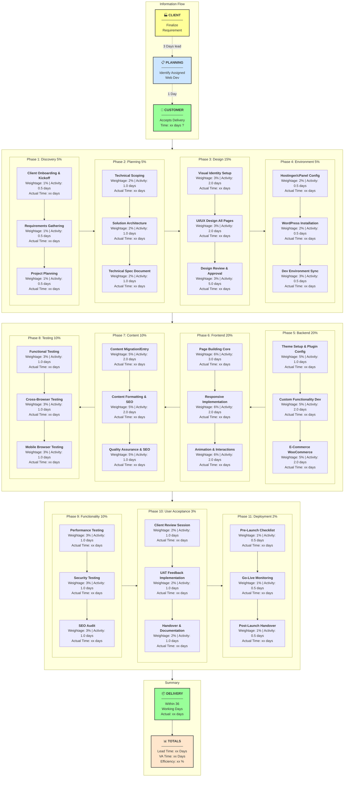

```mermaid
---
config:
  theme: default
---
flowchart TB
    %% Information Flow - Vertical (Above Phase 1)
    subgraph Info ["Information Flow"]
        direction TB
        Supplier["🏭 <b>CLIENT</b><br/>─────────<br/>Finalize<br/>Requirement"]
        Planning["📋 <b>PLANNING</b><br/>─────────<br/>Identify Assigned<br/>Web Dev"]
        Customer["👤 <b>CUSTOMER</b><br/>─────────<br/>Accepts Delivery<br/>Time: xx days ?"]
        Supplier -.->|"3 Days lead"| Planning
        Planning -.->|"1 Day"| Customer
    end

    %% Row 1: P1 → P2 → P3 → P4
    subgraph Row1 [" "]
        direction LR
        subgraph P1 ["Phase 1: Discovery 5%"]
            A1["<b>Client Onboarding & Kickoff</b><br/>Weightage: 1% | Activity: 0.5 days<br/>Actual Time: xx days"]
            A2["<b>Requirements Gathering</b><br/>Weightage: 1% | Activity: 0.5 days<br/>Actual Time: xx days"]
            A3["<b>Project Planning</b><br/>Weightage: 1% | Activity: 0.5 days<br/>Actual Time: xx days"]
            A1 --> A2 --> A3
        end
        subgraph P2 ["Phase 2: Planning 5%"]
            A4["<b>Technical Scoping</b><br/>Weightage: 2% | Activity: 1.0 days<br/>Actual Time: xx days"]
            A5["<b>Solution Architecture</b><br/>Weightage: 2% | Activity: 1.0 days<br/>Actual Time: xx days"]
            A6["<b>Technical Spec Document</b><br/>Weightage: 2% | Activity: 1.0 days<br/>Actual Time: xx days"]
            A4 --> A5 --> A6
        end
        subgraph P3 ["Phase 3: Design 15%"]
            A7["<b>Visual Identity Setup</b><br/>Weightage: 3% | Activity: 2.0 days<br/>Actual Time: xx days"]
            A8["<b>UI/UX Design All Pages</b><br/>Weightage: 3% | Activity: 2.0 days<br/>Actual Time: xx days"]
            A9["<b>Design Review & Approval</b><br/>Weightage: 3% | Activity: 5.0 days<br/>Actual Time: xx days"]
            A7 --> A8 --> A9
        end
        subgraph P4 ["Phase 4: Environment 5%"]
            A11["<b>Hostinger/cPanel Config</b><br/>Weightage: 2% | Activity: 0.5 days<br/>Actual Time: xx days"]
            A12["<b>WordPress Installation</b><br/>Weightage: 2% | Activity: 0.5 days<br/>Actual Time: xx days"]
            A13["<b>Dev Environment Sync</b><br/>Weightage: 3% | Activity: 0.5 days<br/>Actual Time: xx days"]
            A11 --> A12 --> A13
        end
        P1 --> P2 --> P3 --> P4
    end

    %% Row 2: P5 → P6 → P7 → P8 (visually right to left)
    subgraph Row2 [" "]
        direction RL
        subgraph P5 ["Phase 5: Backend 20%"]
            A14["<b>Theme Setup & Plugin Config</b><br/>Weightage: 5% | Activity: 1.0 days<br/>Actual Time: xx days"]
            A15["<b>Custom Functionality Dev</b><br/>Weightage: 5% | Activity: 2.0 days<br/>Actual Time: xx days"]
            A16["<b>E-Commerce WooCommerce</b><br/>Weightage: 5% | Activity: 2.0 days<br/>Actual Time: xx days"]
            A14 --> A15 --> A16
        end
        subgraph P6 ["Phase 6: Frontend 20%"]
            A18["<b>Page Building Core</b><br/>Weightage: 6% | Activity: 3.0 days<br/>Actual Time: xx days"]
            A19["<b>Responsive Implementation</b><br/>Weightage: 6% | Activity: 2.0 days<br/>Actual Time: xx days"]
            A21["<b>Animation & Interactions</b><br/>Weightage: 6% | Activity: 2.0 days<br/>Actual Time: xx days"]
            A18 --> A19 --> A21
        end
        subgraph P7 ["Phase 7: Content 10%"]
            A23["<b>Content Migration/Entry</b><br/>Weightage: 5% | Activity: 2.0 days<br/>Actual Time: xx days"]
            A24["<b>Content Formatting & SEO</b><br/>Weightage: 5% | Activity: 2.0 days<br/>Actual Time: xx days"]
            A24b["<b>Quality Assurance & SEO</b><br/>Weightage: 5% | Activity: 1.0 days<br/>Actual Time: xx days"]
            A23 --> A24 --> A24b
        end
        subgraph P8 ["Phase 8: Testing 10%"]
            A25["<b>Functional Testing</b><br/>Weightage: 3% | Activity: 1.0 days<br/>Actual Time: xx days"]
            A26["<b>Cross-Browser Testing</b><br/>Weightage: 3% | Activity: 1.0 days<br/>Actual Time: xx days"]
            A27["<b>Mobile Browser Testing</b><br/>Weightage: 3% | Activity: 1.0 days<br/>Actual Time: xx days"]
            A25 --> A26 --> A27
        end
        P5 --> P6 --> P7 --> P8
    end

    %% Row 3: P9 → P10 → P11
    subgraph Row3 [" "]
        direction LR
        subgraph P9 ["Phase 9: Functionality 10%"]
            A28["<b>Performance Testing</b><br/>Weightage: 3% | Activity: 1.0 days<br/>Actual Time: xx days"]
            A28b["<b>Security Testing</b><br/>Weightage: 3% | Activity: 1.0 days<br/>Actual Time: xx days"]
            A28c["<b>SEO Audit</b><br/>Weightage: 3% | Activity: 1.0 days<br/>Actual Time: xx days"]
            A28 --> A28b --> A28c
        end
        subgraph P10 ["Phase 10: User Acceptance 3%"]
            A30["<b>Client Review Session</b><br/>Weightage: 2% | Activity: 1.0 days<br/>Actual Time: xx days"]
            A31["<b>UAT Feedback Implementation</b><br/>Weightage: 2% | Activity: 1.0 days<br/>Actual Time: xx days"]
            A31b["<b>Handover & Documentation</b><br/>Weightage: 2% | Activity: 1.0 days<br/>Actual Time: xx days"]
            A30 --> A31 --> A31b
        end
        subgraph P11 ["Phase 11: Deployment 2%"]
            A34["<b>Pre-Launch Checklist</b><br/>Weightage: 1% | Activity: 0.5 days<br/>Actual Time: xx days"]
            A34b["<b>Go-Live Monitoring</b><br/>Weightage: 1% | Activity: 0.5 days<br/>Actual Time: xx days"]
            A34c["<b>Post-Launch Handover</b><br/>Weightage: 1% | Activity: 0.5 days<br/>Actual Time: xx days"]
            A34 --> A34b --> A34c
        end
        P9 --> P10 --> P11
    end

    %% Summary - Vertical (Below Phase 11)
    subgraph Summary ["Summary"]
        direction TB
        Ship["📦 <b>DELIVERY</b><br/>─────────<br/>Within 36<br/>Working Days<br/>Actual: xx days"]
        Totals["📊 <b>TOTALS</b><br/>─────────<br/>Lead Time: xx Days<br/>VA Time: xx Days<br/>Efficiency: xx %"]
        Ship --> Totals
    end

    %% Main vertical flow: Info → Row1 → Row2 → Row3 → Summary
    Info --> Row1
    Row1 --> Row2
    Row2 --> Row3
    Row3 --> Summary

    %% Styles
    style Supplier fill:#ffff99,stroke:#333,stroke-width:2px
    style Planning fill:#cce5ff,stroke:#333,stroke-width:2px
    style Customer fill:#99ff99,stroke:#333,stroke-width:2px
    style Ship fill:#99ff99,stroke:#333,stroke-width:2px
    style Totals fill:#ffe6cc,stroke:#333,stroke-width:2px
```
